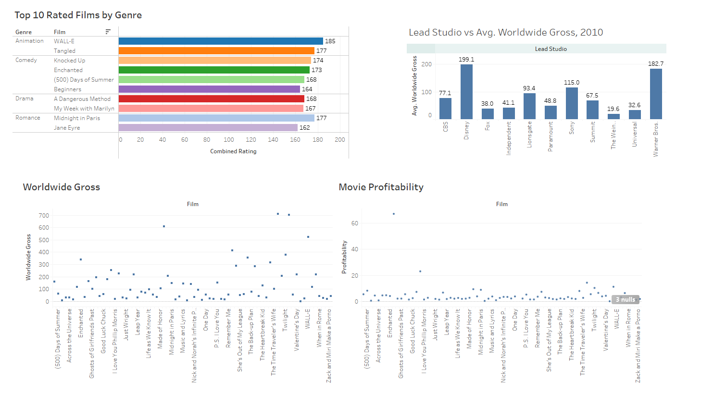

# Data Analysis Portfolio

# [Project 1: Movie Recommendation System Model](https://izuchukwukings.github.io/king-s_portfolio/)

This is a personal project where Tableau visualization dashboard was used to recommend movies based on ratings for a movie dataset.

* Data was taken from Kaggle movie recommendation dataset
* The model utilized Microsoft Excel to extract and clean the dataset and the visualization was done using Tableau;
* You can view the live dashboard [here](https://public.tableau.com/app/profile/izuchukwu.ugwuodo/viz/Book1_17168005081300/Dashboard1)

# Overview of the top 10 rated films, gross, and profitability per movies 

#[Project 2: Nations in Focus: HDI](https://izuchukwukings.github.io/king-s_portfolio/)

This project dives into the fascinating world of global development with this interactive data analysis project! Through this journey, we'll uncover how the Human Development Index (HDI) paints a vivid picture of life expectancy, education, and income across different countries.

#Tools and techniques 

* Data was taken from Kaggle human footprint dataset
* Microsoft Excel to extract and engage with compelling Tableau dashboards that bring the data to life.
* You can view the live dashboard [here](https://public.tableau.com/app/profile/izuchukwu.ugwuodo/viz/Book1_17168005081300/Dashboard1)

# Overview of the top 10 rated films, gross, and profitability per movies 

